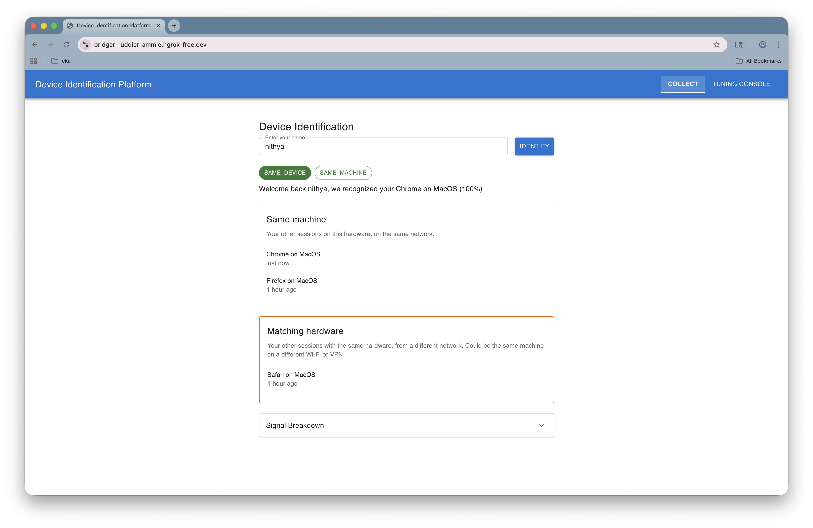
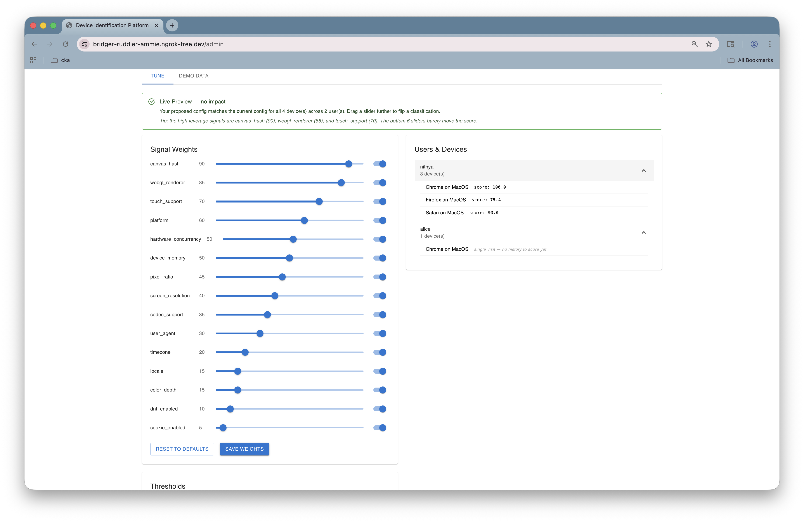
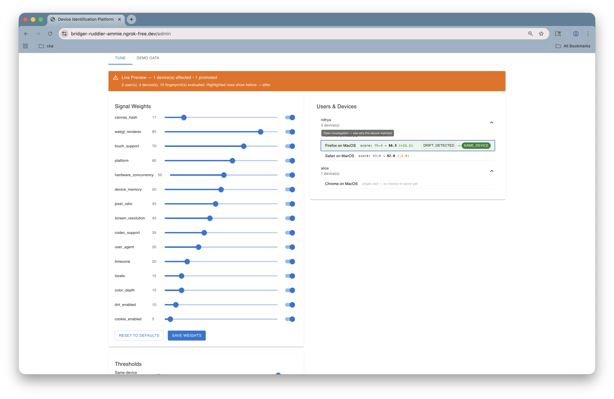
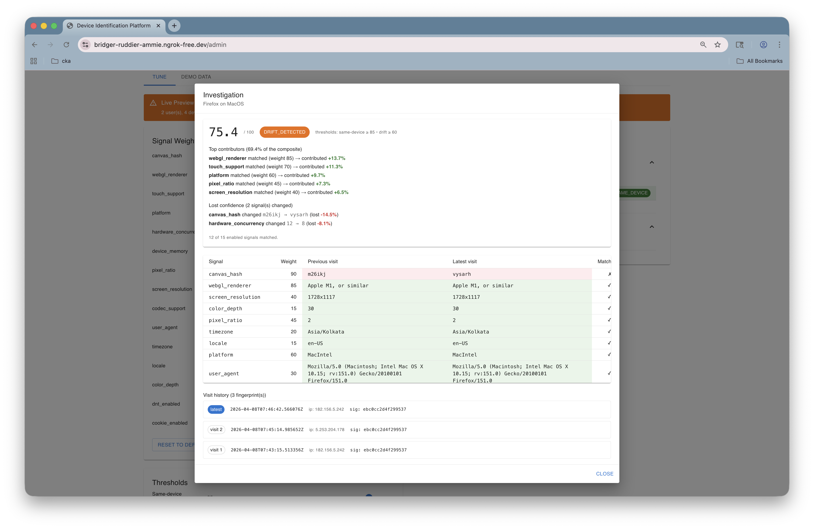
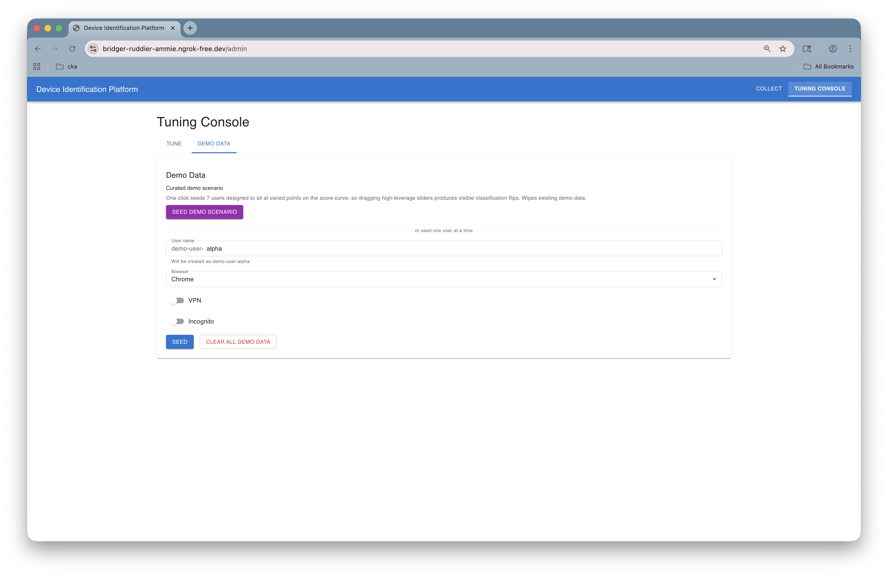
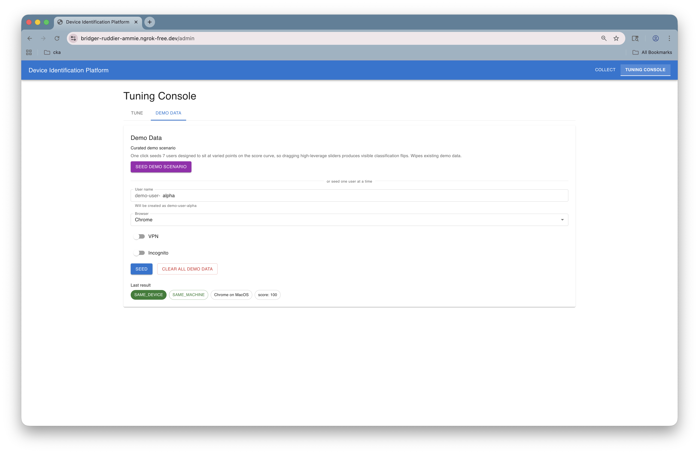

# Device Identification Management Platform

A full-stack device fingerprinting and identification management platform built with AI-assisted development.

> **Reference only — not for commercial use.** This repository is published as an educational artefact and a demonstration of disciplined AI-assisted development. It is licensed under [PolyForm Noncommercial 1.0.0](LICENSE), which permits study, research, personal use, and modification for non-commercial purposes, and forbids commercial sale or deployment. See the [License](#license) section below.

## What this is

A fully-tested full-stack device fingerprinting product, built solo with AI pairing, that demonstrates:

- **Two independent identification mechanisms**, each catching what the other misses:
  - Phase 1: per-user weighted similarity scoring across 15 browser signals
  - Phase 2: per-user cross-browser machine signature (hashes the browser-independent signals so the same laptop on Chrome and Firefox produces the same hash)
- **A live tuning console** at `/admin` where an admin can drag weight and threshold sliders and watch the impact on every stored device in real time (the *Ripple Effect*).
- **Per-decision explainability** via an Investigation modal that drills into a single device and shows the per-signal contribution breakdown — *"why was this matched?"* with a side-by-side signal table.
- **Disciplined commit history** — every commit atomic, every commit green, backend and frontend always separated. The [`git log`](https://github.com/nithyanatarajan/device-fingerprint-demo/commits/master) is itself part of the pitch.

## What this is *not*

- **Not a production fingerprinting product.** No authentication, no rate limiting, no data retention policy, no observability beyond Spring Boot defaults, no multi-tenancy. These are listed as "out of scope" in [`SPEC.md`](SPEC.md) — each would be a sizable phase in its own right.
- **Not a comparison or benchmark** of fingerprinting techniques. The signals chosen are illustrative, not optimal.
- **Not a reusable library.** It's a complete product wired end to end. Read it, study it, take ideas from it. Do not vendor it as a dependency.

## Screenshots

A walk through the product without running it. Captured against a real macOS browser session over an ngrok tunnel.

### 1. The visitor flow — Collect page



A returning visitor identifies as `nithya`. Two verdict chips agree: `SAME_DEVICE` (Phase 1 — per-device weighted scoring) and `SAME_MACHINE` (Phase 2 — per-user cross-browser hardware signature). The Same Machine panel lists every browser this user has signed in from on this hardware, and the Matching Hardware panel lists sessions that share the hardware but came from a different network.

### 2. Tuning Console — at rest



The Tune tab after one click of "Seed demo scenario". 15 weight sliders on the left, the 7-user curated dataset on the right with each device's current composite score visible inline. Sticky Live Preview banner at the top is currently green ("no impact") because no slider has been touched.

### 3. The Ripple Effect — drag a slider, see the impact live



Mid-drag of a single slider. The orange banner reports `1 device(s) affected • 1 promoted`. The Firefox row in the Users & Devices list highlights green and shows its before→after classification chips. Backend re-runs the entire scoring set against the proposed config in ~50ms; nothing is persisted until you hit Save.

### 4. Investigation modal — explainability



Click any device row to drill in. The modal shows the composite score (`75.4`), the classification chip (`DRIFT_DETECTED`), the active threshold context, then a breakdown: which signals matched and contributed how many percentage points, which signals lost confidence and by how much, the full 15-signal side-by-side comparison table with green/amber/red cells, and the visit history at the bottom. Every number on the page sums to the composite — the audit log a security analyst would pull up to defend a decision.

### 5. Demo Data tab — seeding controls



The Demo Data tab is a separate workspace so the live demo never has to look at it. At the top: a one-click curated scenario seed. Below: a per-user seed form for fine-grained scenarios with the `demo-user-` prefix pinned as a non-editable adornment so the user only types the suffix. At the bottom: the destructive "Clear all demo data" action.



After seeding, the "Last result" chips at the bottom show what the live Collect page would have shown for the same input — verdict, machine match verdict, device label, score. So the audience can watch each seeded visit produce its outcome in real time without leaving the tab.

## Documentation

- [`SPEC.md`](SPEC.md) — formal product specification (data model, scoring engine, phased build, API list)
- [`docs/how-it-works.md`](docs/how-it-works.md) — end-to-end mental model: the "two voices" architecture, what each phase does, why each signal is included or excluded from the hash, scenario reference, and the false positive trade-off
- [`docs/demo/scenarios.md`](docs/demo/scenarios.md) — Phase 2 scenario matrix (real browser captures) + Phase 3/4 curated seed table
- [`docs/demo/findings.md`](docs/demo/findings.md) — observed behaviour and insights from the manual Phase 2 test pass
- [`docs/demo/recordings/`](docs/demo/recordings/) — captured request/response payloads and screenshots for every Phase 2 scenario

## Tech Stack

- **Backend:** Java 25 + Spring Boot 4 + Gradle
- **Frontend:** React 19.2.4 + Material UI + Vite
- **Database:** H2 (embedded)

## Prerequisites

- Java 25
- Node.js 22+
- Gradle 9.0+

## Environment variables

If you use [direnv](https://direnv.net/), copy `envrc.sample` to `.envrc` and run `direnv allow`. The sample sets:

- `DATABASE_URL` and `DDL_AUTO` — switch the backend to persistent file-mode H2 so seeded data survives restarts (see [Persistent mode](#backend) below).
- `NGROK_AUTHTOKEN` — optional override for the ngrok auth token used by `npm run demo`. Commented out by default; uncomment and fill in if you don't already have a standalone `ngrok` CLI config.

```bash
cp envrc.sample .envrc
direnv allow
```

`.envrc` is gitignored (`.env*`) so your local copy stays out of version control. Without direnv you can `source envrc.sample` manually, or just paste the `export` lines into your shell.

The full list of recognised env vars is in the [Environment Variables](#environment-variables) reference at the bottom.

## Getting Started

### Backend

```bash
cd backend
./gradlew bootRun
```

Backend runs on `http://localhost:8080`. Default datasource is in-memory H2 — every restart wipes the data.

**Persistent mode** (data survives backend restarts) — opt in via env vars:

```bash
DATABASE_URL='jdbc:h2:file:./data/deviceid;AUTO_SERVER=TRUE' \
DDL_AUTO=update \
./gradlew bootRun
```

This writes to `backend/data/deviceid.mv.db` (gitignored) and migrates the schema additively across restarts. `AUTO_SERVER=TRUE` allows multiple JVMs to share the file, so tests don't deadlock if you run them while a `bootRun` is up. Use this when preparing a demo so seeded data and test runs survive.

### Frontend

```bash
cd frontend
npm install
npm run dev
```

Frontend runs on `http://localhost:5173` and proxies API requests to the backend.

### Seed Data

To populate the database with synthetic users and devices:

```bash
cd backend
SEED_DATA=true ./gradlew bootRun
```

### Live demo via ngrok

For a real cross-browser, cross-network demo, the local stack can be exposed via an ngrok tunnel using the bundled orchestration script. This is the only way to exercise Phase 2's IP-tier behaviour from outside `localhost` (loopback traffic doesn't traverse a VPN, so curl-against-localhost can't simulate IP-tier transitions).

**One-time setup:**
1. Sign up for a free ngrok account at <https://dashboard.ngrok.com/signup>.
2. Install and authenticate the CLI as described at <https://dashboard.ngrok.com/get-started/setup/macos> (or your platform). This writes a config file the SDK reads automatically (`~/Library/Application Support/ngrok/ngrok.yml` on macOS, `~/.config/ngrok/ngrok.yml` on Linux).
3. Verify with `ngrok config check` — should print `Valid configuration file`.

**Running the demo:**
```bash
cd frontend
npm install        # one-time, if not already done
npm run demo
```

The script:
1. Resolves the ngrok authtoken from `NGROK_AUTHTOKEN` env var, or falls back to parsing the standalone CLI config file (`~/Library/Application Support/ngrok/ngrok.yml` on macOS, `~/.config/ngrok/ngrok.yml` on Linux)
2. Brings up the backend (`./gradlew bootRun`) and the frontend dev server (`vite`) — **but skips either if it's already running on its port**, so you can keep your existing dev servers and just expose them via the tunnel
3. Starts an ngrok tunnel pointing at the frontend port
4. Prints the public URL — open it in any browser, hand it to anyone, switch VPN on/off between visits to see Phase 2's `SAME_MACHINE` ↔ `MATCHING_HARDWARE` chip transition

Press `Ctrl+C` to tear everything down cleanly. Only processes the script started are killed; existing dev servers you started yourself keep running.

**Tunnel-only mode is automatic.** If both backend and frontend are already running on their ports when you run `npm run demo`, the script detects them, skips starting new ones, and just opens the ngrok tunnel. `Ctrl+C` then closes only the tunnel — your dev servers are untouched.

**Stopping ngrok safely:**

- **From the same terminal that started it:** press `Ctrl+C`. The script disconnects the tunnel cleanly and only kills processes it started itself.
- **From a different shell, if the script hangs:** `pkill -f "node scripts/demo.mjs"`. As a last resort to clear all local ngrok agents: `pkill -f ngrok`.
- **Stale tunnels on the ngrok side** (free tier allows only one simultaneous tunnel — a previous run that didn't disconnect cleanly will block the next one): visit <https://dashboard.ngrok.com/agents> and revoke the stale agent.

> **Note on the SDK and the CLI config file:** the `@ngrok/ngrok` Node SDK is a separate Rust binary embedded in the Node module — it does *not* automatically read the standalone `ngrok` CLI's config file. The demo script reads the file itself and passes the token explicitly, so `ngrok config add-authtoken <token>` is sufficient and you do not also need to set `NGROK_AUTHTOKEN`.

## Testing

### Backend

```bash
cd backend
./gradlew build    # runs spotless, checkstyle, tests, coverage
```

### Frontend

```bash
cd frontend
npm run check          # lint + format check
npm run fix            # auto-fix lint + format
npm test               # Vitest unit tests
npm run test:coverage  # with coverage
npm run ci             # full CI: check + build + test:coverage
```

#### End-to-end tests (Playwright)

E2E tests exercise the full flow: browser → FingerprintJS → backend. They require the backend to be running:

```bash
# Terminal 1
cd backend && ./gradlew bootRun

# Terminal 2
cd frontend
npx playwright install chromium        # one-time browser install
npm run test:e2e                       # runs against chromium (default)
npm run test:e2e:all                   # runs across chromium + firefox + webkit
npm run test:e2e -- --project=firefox  # single non-default browser
```

##### Debugging E2E failures

```bash
npm run test:e2e -- --headed           # watch the browser run
npm run test:e2e -- --debug            # step through with Playwright Inspector
npm run test:e2e -- --ui               # interactive UI mode (best DX)

npx playwright show-report             # open the HTML report from the last run
npx playwright show-trace test-results/<name>/trace.zip  # view a recorded trace
```

On failure, the config automatically captures: trace (timeline + DOM snapshots + network), screenshot, and video. They land in `test-results/` and `playwright-report/`.

## Environment Variables

| Variable | Default | Description |
|----------|---------|-------------|
| `SERVER_PORT` | `8080` | Backend server port |
| `DATABASE_URL` | `jdbc:h2:mem:deviceid` | Backend JDBC URL. Set to `jdbc:h2:file:./data/deviceid;AUTO_SERVER=TRUE` (combined with `DDL_AUTO=update`) for persistent demo prep mode. |
| `DDL_AUTO` | `create-drop` | Hibernate schema management mode. Use `update` with file-mode `DATABASE_URL` to preserve data across backend restarts. |
| `SEED_DATA` | `false` | Enable synthetic data seeding |
| `VITE_API_URL` | `http://localhost:8080` | Backend URL for frontend proxy |
| `VITE_PORT` | `5173` | Frontend dev server port |
| `VITE_CAPTURE_DIR` | `docs/demo/recordings/` | Folder shown in the Collect-page Capture Mode helper text. Override only if the docs layout is reorganised. |
| `NGROK_AUTHTOKEN` | *(read from ngrok config file)* | Optional override for the ngrok auth token used by `npm run demo`. The script also accepts the token from the standard ngrok config file written by `ngrok config add-authtoken`. |

## License

This project is licensed under the [PolyForm Noncommercial License 1.0.0](LICENSE).

You may study, modify, and use it for any **non-commercial** purpose — personal use, research, experimentation, hobby projects, education, public-interest work, etc. **Commercial use of any kind is not permitted.** That includes selling the software, deploying it as a hosted service for paying customers, or embedding it in a commercial product.

If you have a commercial use case in mind, the license is a one-way ratchet under the maintainer's control — open an issue and let's talk.

The full license text is in [`LICENSE`](LICENSE) at the repo root.
